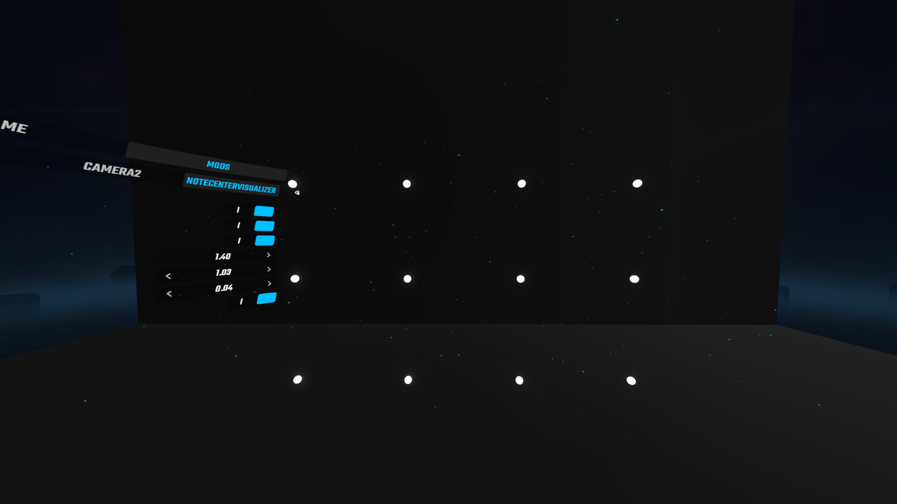
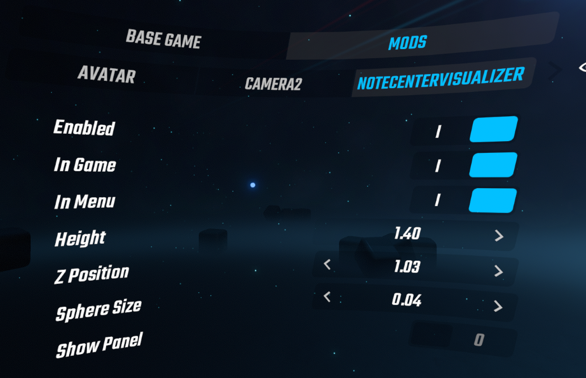
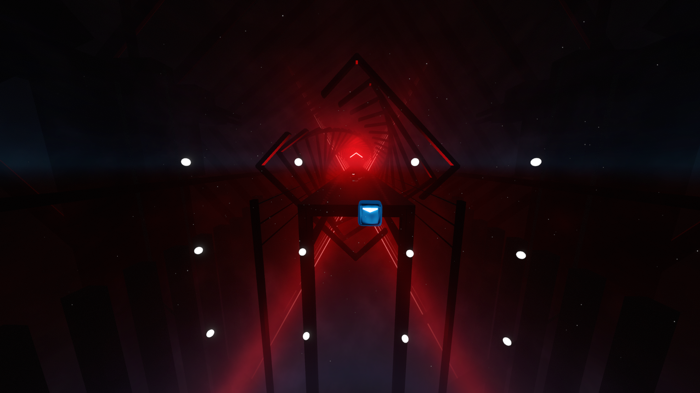
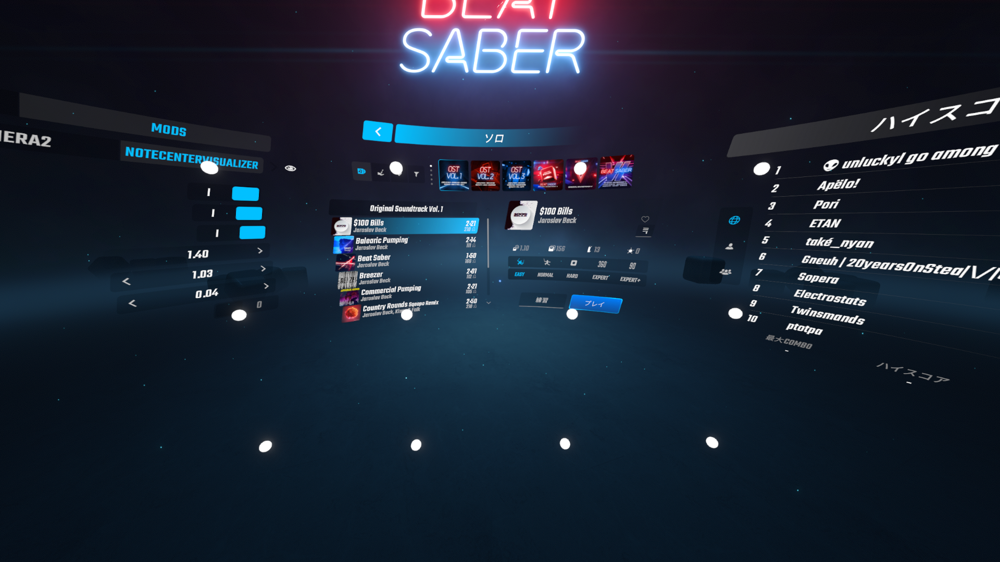

# NoteCenterVisualizer

ノーツの中心位置にあたる箇所に球体を表示するMOD 
飛んでくるノーツだとどうしてもスイングが直せなくてメニュー画面で素振りできるよう自分用に作ってみた  

  

## インストール

このMODには以下のMODが必要です 
- BSIPA 4.3.6以上 
- SiraUtil 3.2.1以上 
- BeatSaberMarkupLanguage 1.12.5以上  

リリースページからゲームバージョンの最新の.dllをダウンロードし 、/pluginsゲームフォルダ内のディレクトリ に配置します  

## 使用方法

曲選択の画面左側、MODタブに設定UIがあるので操作してください  
  

- Enable MODの有効/無効
- InGame 曲プレイ画面で表示/非表示
- InMenu メニュー画面で表示/非表示
- Height 身長設定に合わせる(現状1.4m～1.8mの範囲 そのうち不要にしたい)
- Z Position 球体のZ座標調整
- Sphere Size 球体のサイズ調整
- Show Panel メニュー画面で球体を表示したときにUIを隠すパネルを表示

 <曲プレイ中の表示> 
  

<曲選択画面での表示、パネル非表示> 
  

## 注意事項
プログラミング知識が少ない中で作成したので使用は自己責任で
